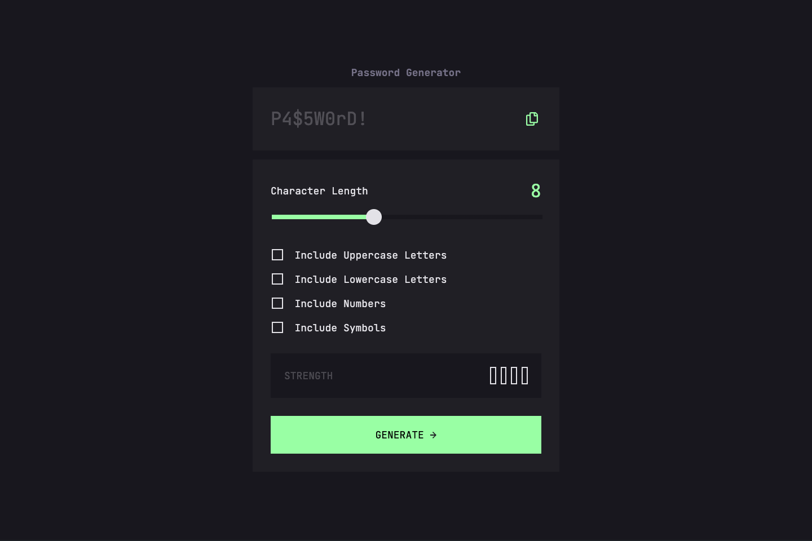

# Password Generator

A password generator that lets users customize length and character types and view the strength of the generated password.



[Live Demo](https://matt-miguel.github.io/Password-Generator-App/) · [View Code](https://github.com/matt-miguel/Password-Generator-App)

---

## Overview

Users can generate passwords with 4 types of characters and length of up to 20 characters. The strength of the password is displayed based on the length and number of choices. Passwords can be copied to the clipboard with one click.

---

## Features

- Generate a password based on selected options
- Copy the generated password to the computer's clipboard
- See a strength rating for their generated password
- View the optimal layout for the interface depending on their device's screen size
- See hover and focus states for all interactive elements on the page

---

## Technical Highlights

**Strength Display styles with CSS only**

The colors of the strength bars are handled with CSS only using the `:has()` selector and siblings selector. JavaScript is only used to toggle one class on the correct bar, then CSS renders the styles for all the strength bars.

**Custom Inputs**

The slider and checkboxes were customized with CSS by visually hiding the native inputs and applying custom styles, while still keeping the function and accessibility of the input.

---

## Tech Stack

- Semantic HTML
- CSS (custom properties, :has(), sibling selector)
- JavaScript (ES6+, Clipboard API)

---

## Getting Started

```bash
git clone https://github.com/matt-miguel/Password-Generator-App
```

This is a vanilla JS project with no build step. Clone the repo and open index.html in your browser.

---

## Challenges & What I Learned

**Dynamically handling strength styles**

I wanted a way to style the strength bars without having to toggle classes on every bar. This is where the CSS `has()` and sibling selectors came in handy so that each bar was styled with the addition of one class. This simplifies the JavaScript and makes the CSS more predictable.

---

## What I'd Improve

**Guarantee at least one character from each selected type**

Currently the password is generated by randomly picking from a pool of all selected characters. This means it's possible (albeit unlikely) to generate a password with uppercase selected but no uppercase characters appearing. A better approach would be to guarantee one character from each selected type first, then fill the remaining length randomly, and finally shuffle the result so the guaranteed characters aren't always at the start.

**More robust strength checking**

Currently the password length can be adjusted down to 1. However strong passwords require a minimum of 8 characters. I would adjust the slider to not allow values below 8. I would also consider judging the length by more than just the number of options. A longer password with 2 or 3 options selected could be a strong password. Therefore I would add additional logic to account for the length.
