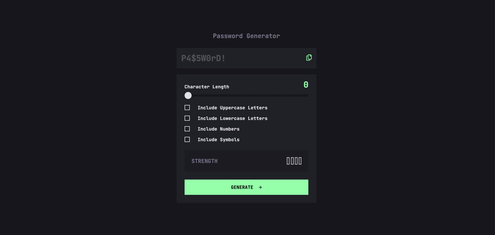

# Frontend Mentor - Password generator app solution

This is a solution to the [Password generator app challenge on Frontend Mentor](https://www.frontendmentor.io/challenges/password-generator-app-Mr8CLycqjh). Frontend Mentor challenges help you improve your coding skills by building realistic projects. 

## Table of contents

- [Overview](#overview)
  - [The challenge](#the-challenge)
  - [Screenshot](#screenshot)
  - [Links](#links)
- [My process](#my-process)
  - [Built with](#built-with)
  - [What I learned](#what-i-learned)
  - [Continued development](#continued-development)
  - [Useful resources](#useful-resources)
- [Author](#author)

**Note: Delete this note and update the table of contents based on what sections you keep.**

## Overview

### The challenge

Users should be able to:

- Generate a password based on the selected inclusion options
- Copy the generated password to the computer's clipboard
- See a strength rating for their generated password
- View the optimal layout for the interface depending on their device's screen size
- See hover and focus states for all interactive elements on the page

### Screenshot

### Links

- Solution URL: [Add solution URL here](https://github.com/MattJM1007/Password-Generator-App)
- Live Site URL: [Add live site URL here](https://mattjm1007.github.io/Password-Generator-App/)

## My process

### Built with

- Semantic HTML5 markup
- CSS custom properties
- Flexbox

### What I learned

Learned a lot on this project. Learned how to customize the slider and checkboxes from their defualt html look. Also learned how to add javascript to make the slider interactive.

### Continued development

Keep learning more about customizing elements and learning to make Javascript code more condense and readable. 

### Useful resources

- [Customize Range Slider](https://www.w3schools.com/howto/howto_js_rangeslider.asp) - This helped me learn how to customize the range slider from the default look.
- [Making checkboxes](https://www.w3schools.com/tags/att_input_type_checkbox.asp) 
- [Font Face CSS](https://www.w3schools.com/cssref/atrule_font-face.php)
- [Customizing Checkboxes CSS](https://www.w3schools.com/howto/howto_css_custom_checkbox.asp) - This helped with customizing the check boxes
- [Event oninput JS](https://www.w3schools.com/jsref/event_oninput.asp)

## Author

- Frontend Mentor - [@MattJM1007](https://www.frontendmentor.io/profile/MattJM1007)
